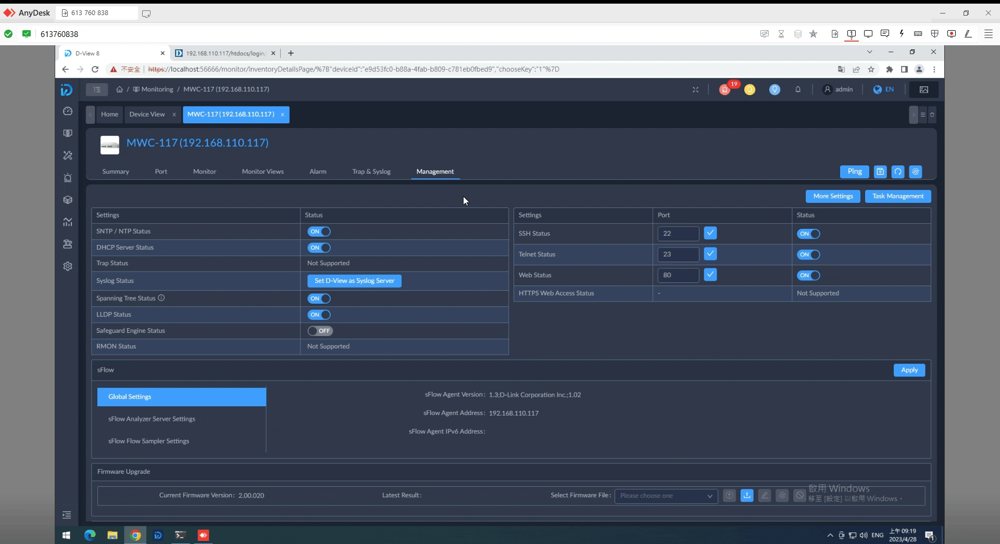

<h1> Dview8 QA Tips </h1>


   
## ```Recommend Tools```

+ WSL
+ Wireshark
+ putty
+ tftp64


## ``` Tools cheatsheet ```

  + [WSL install reference](https://learn.microsoft.com/zh-tw/windows/wsl/install)
     
  +  WireShark
  
     use ``` ip.addr==targetIP ``` to filter IP, add && means AND another parameter to filter packages, like sflow, tftp etc.  
  + putty
    <br> 
    I just use to connect console port.
    

    <font color=red>COM*</font> is your serial port

    

    If you can't connect console with serial port, change baud rate 9600 => 115200
  + tftp64
    

    <font color=red>Probe Must stop</font> or TFTP's 69 port got used tftp64 cannot launch !

    ``` Set a directory as server's files ```

    I create tftp dir on Desktop to save firmware then GUI choose tftp upgrade set your localIP and your file name.


## ``` QA Test Records ```

- [Verify the Templates](#verify-the-templates)
- [Device View](#device-view)
- [Panel](#panel)
- [Port\_Traffic](#port_traffic)
- [PrivatePortInfo](#privateportinfo)
- [BaseInfo](#baseinfo)
- [Device Common Info](#device-common-info)
- [CPU Utiliztion \& Memory Utilzation](#cpu-utiliztion--memory-utilzation)
- [Temperature](#temperature)
- [Fan(if supported)](#fanif-supported)
- [PowerStatus(if support)](#powerstatusif-support)
- [LACP](#lacp)
- [Stack](#stack)
- [DLMS(if support)](#dlmsif-support)
- [SNTP](#sntp)
- [DHCP](#dhcp)
- [Trap](#trap)
- [Syslog](#syslog)
- [STP](#stp)
- [LLDP](#lldp)
- [Safeguard Engine](#safeguard-engine)
- [RMON](#rmon)
- [SSH](#ssh)
- [Telnet](#telnet)
- [HTTP \& HTTPS](#http--https)
- [Backup](#backup)
- [Restore](#restore)
- [Firmware Upgrade](#firmware-upgrade)
- [Reboot](#reboot)
- [PoE](#poe)
- [sFlow](#sflow)
- [Save](#save)
# Verify the Templates


1. Monitor Tamplate
   
2. Configuration Tamplate
   
3. Panel Tamplate
   
4. Other(SOID, Model Name, Hardware Version etc.)
      

# Device View


# Panel


* <font color=#FF0000>Red Arrow</font> - Layout & Vendor Icon
* <font color=#8000a0>Purple</font> Arrow - Port Type

# Port_Traffic

  - MIB Browser
   

   Search <font color=aqua>interfaces</font> click it will see ifTable
   <br>
   Search <font color=ruby>ifMIB</font> click it then click ifMIBObjects will see ifXTable 
   

# PrivatePortInfo
   <br>
   `` used to turn on loopback detection ``
   
   


# BaseInfo
   
   

   These toast need to support read-write

# Device Common Info
   check MAC, Hardware, Firmware, Total Flash(if supported)
   

   SN(Serial Number)

   

   

# CPU Utiliztion & Memory Utilzation
   

   
   
   
   
   
   
   
   
   

# Temperature
   

   Customized Dashboard & Reports same as CPU & Memory

# Fan(if supported)
   

# PowerStatus(if support)
 ```  refer to Fan > Device Detail Hardware Health ```  


# LACP
  

  
# Stack
  

  content: 
  + set priority ASC or DESC <font color='red' size=5 px>Base on device's manual</font> decide which device is master, others are slave, if priority same (like example) will base on MAC ADDRESS usually.
  + stacking port's linking method have two type, one is ring the other is chain
    - Chain
    

    - Ring
     
# DLMS(if support)
  
# SNTP
   
   
# DHCP
  
  
# Trap
  
# Syslog
  
# STP
  
  
# LLDP
  
# Safeguard Engine
  
# RMON
  
  
# SSH
  
  
  
# Telnet
  
  
  
  
  
# HTTP & HTTPS
  
  
  
  
  
  
  
# Backup
  
# Restore 
  <font color='#1da' size=5 px>refer to Backup and compare with it</font> 

  
  
  
  
# Firmware Upgrade
  
  
  
  
  
# Reboot
  
  
  
# PoE
  
- [ ] 802.1Q VLAN
# sFlow
  

  content: 
   * Collect Address is your Local IP, if device ip 192.168.110.*, <font color='red'>your need to change your Local IP</font> , for example is at 192.168.220.* 
   * ```(same logic on backup and restore, if you failed check IP first)```
   * Sampler Port fill which is Linked, Rate set Max(65536)
   * Counter Poller Interval means 1/*packages.
# Save
   

